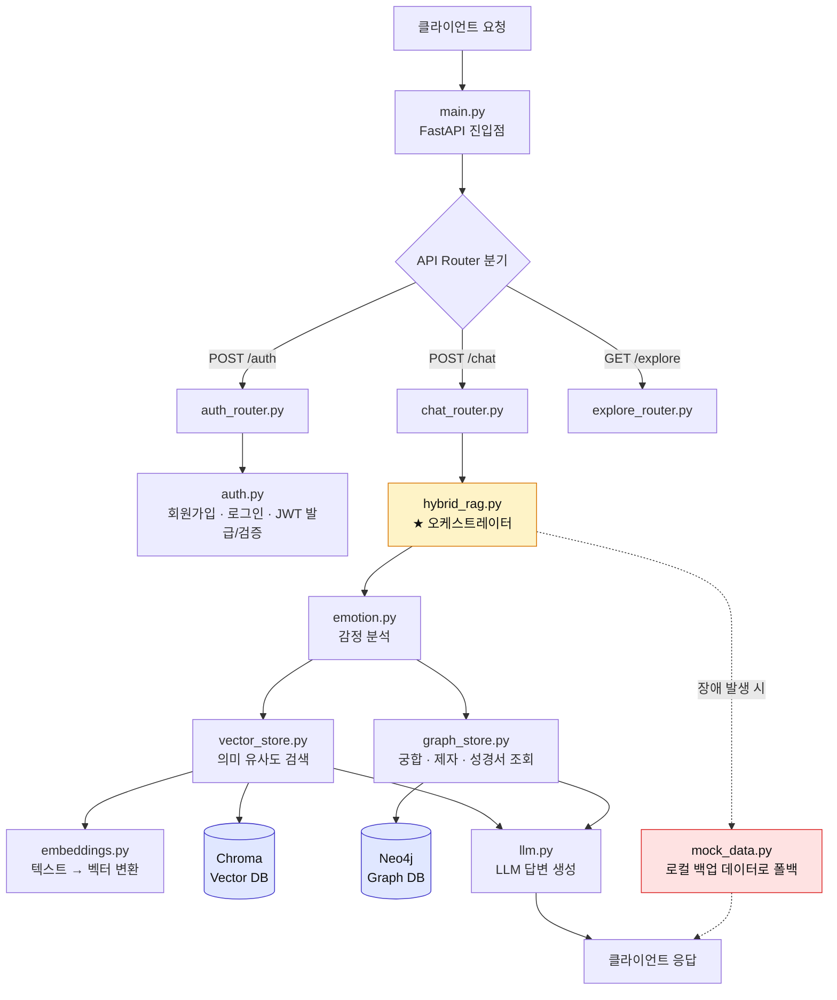
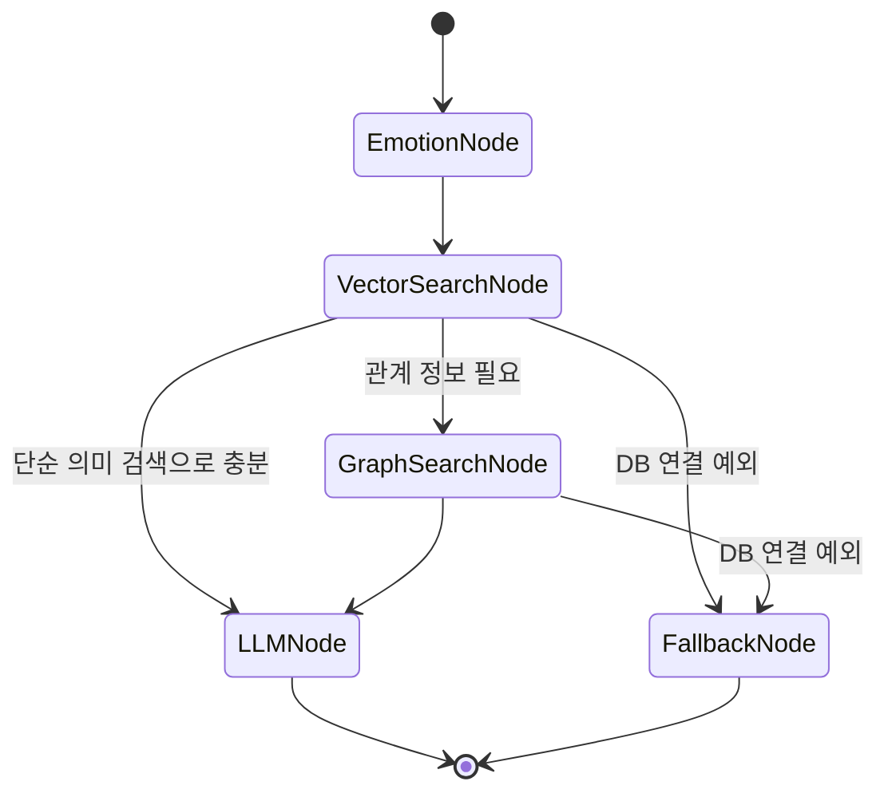

# 📖 로컬 RAG 기반 성경구절 검색 챗봇 시스템

본 프로젝트는 LLM(ChatOpenAI)과 오픈소스 임베딩 모델을 결합하여, 사용자의 자연어 질문에 맞는 성경 구절을 의미론적으로 검색하고 답변을 생성하는 **온프레미스형 RAG(Retrieval-Augmented Generation) 챗봇**입니다. 

## 1. 팀원 및 역할
<div align="center">
<table align="center">
  <tr>
    <td align="center" width="190px"></td>
    <td align="center" width="190px"></td>
    <td align="center" width="190px"></td>
    <td align="center" width="190px"></td>
  </tr>
  <tr>
    <td align="center"><b>안혁진(PM)</b></td>
    <td align="center"><b>김가율</b></td>
    <td align="center"><b>정형섭</b></td>
    <td align="center"><b>김재원</b></td>
  </tr>
    <tr>
    <td align="center">프론트엔드<br>설계, 기획</td>
    <td align="center">데이터 전처리, 정제<br>문서작성</td>
    <td align="center">Database 설계</td>
    <td align="center">RAG 시스템 구성</td>
  </tr>

  <tr>
    <td align="center"><a href="https://github.com/Jinxxxok"></a></td>
    <td align="center"><a href="https://github.com/Kim-gayul"></a></td>
    <td align="center"><a href="https://github.com/jhs7067"></a></td>
    <td align="center"><a href="https://github.com/kimjae9360"></a></td>
  </tr>
  
</table>

</div>

---
## 2. 주요 특징

유지보수의 효율성과 역할 분담을 극대화하기 위해 코드베이스를 **UI(React), 데이터 레이어(Chroma DB), AI 레이어(LangChain/LangGraph)** 로 분리하여 모듈화했습니다.

- **의미론적 유사도 검색(Dense Retrieval)**: 단순한 키워드 매칭을 넘어, "마음이 슬플 때"와 같은 추상적인 유의어 및 문맥을 파악하여 관련 구절을 추출합니다.
- **고속 벡터 캐싱**: 최초 1회만 JSON 데이터를 임베딩하여 로컬 `chroma_db` 폴더에 물리 저장하며, 2회차 실행부터는 수 초 내에 고속 로드됩니다.
- **자원 최적화**: 무거운 생성형 모델은 ChatOpenAI로 구동하고, 임베딩은 초경량 HuggingFace 로컬 모델로 분리하여 CPU 환경에서도 메모리 오버플로우 없이 안정적으로 작동합니다.
- **할루시네이션(환각) 방지**: 프롬프트 엔지니어링을 통해 제공된 성경 문맥 안에서만 답변하도록 페르소나를 제한했습니다.

## 3. 주요 기능
웹 시연
---

## 4. 프로젝트 구조 (Directory Structure)

```text
eden-portal/
├── frontend/
│   ├── EdenPortal.jsx   # ★ 단일 파일 데모 (그대로 열면 실행). 이미지 내장.
│   ├── api.js           # 백엔드 호출 클라이언트 (배포용, 목업 폴백 내장)
│   └── mock.js          # 오프라인 목업 로직 (백엔드와 동일 궁합/감정)
└── backend/
    ├── app/
    │   ├── core/config.py         # ★ 모델·DB 교체는 전부 여기
    │   ├── services/
    │   │   ├── embeddings.py       # 임베딩 프로바이더 팩토리 (hf/openai/ollama)
    │   │   ├── llm.py              # LLM 프로바이더 팩토리 (ollama/openai/anthropic)
    │   │   ├── vector_store.py     # 성경 Vector DB (Chroma, graph-guided 필터)
    │   │   ├── graph_store.py      # Neo4j 궁합·제자·성경서
    │   │   ├── emotion.py          # 감정 추론 (키워드 + LLM 폴백)
    │   │   ├── hybrid_rag.py       # ★ 오케스트레이터 (recommend/answer)
    │   │   ├── auth.py             # 회원가입·로그인·JWT
    │   │   └── mock_data.py        # DB 미연결 시 폴백
    │   ├── api/                    # auth / chat / explore 라우터
    │   ├── models/schemas.py       # 요청·응답 스키마
    │   └── main.py                 # FastAPI 진입점
    ├── requirements.txt
    └── .env.example
├── bible_structured.json           # 원본 성경 데이터 소스 (JSON)
└── README.md                       # 프로젝트 안내서
```


## 5. 수집한 데이터와 프로젝트의 관련성
* **도메인 특화 지식 구축**: 본 프로젝트는 사용자의 자연어 질문이나 키워드에 맞춰 정확한 성경 구절을 매칭하고, 이를 기반으로 답변을 생성하는 RAG(Retrieval-Augmented Generation) 시스템입니다.
* **의미론적 검색의 기반**: 성경은 비유적 표현, 고어(古語), 추상적인 개념이 많아 단순 키워드 매칭으로는 사용자의 의도(예: '마음이 슬플 때', '평안을 얻고 싶을 때')를 파악하기 어렵습니다. 따라서 전체 성경 데이터를 수집하고 벡터화하여 의미론적 유사도 검색(Dense Retrieval)이 가능하도록 기본 컨텍스트를 제공하는 핵심 역할을 합니다.

## 6. 데이터 수집
* **데이터명**: 성경 전서 (구약 성경 39권 및 신약 성경 27권, 총 66권)
* **데이터 규모**: 총 1,189장, 약 31,000개 이상의 구절(Verse) 데이터
* **데이터 구조**: 각 구절별로 서지 정보(책 이름, 장, 절)와 본문 내용이 매핑된 구조화된 형태의 텍스트 데이터(JSON형식 )
* **데이터 출처**: https://raw.githubusercontent.com/stranger828/bibleAPI/refs/heads/main/bible_structured.json


## 7. 수집한 데이터 전처리
본 프로젝트에서 사용한 데이터는 책 이름, 장, 절과 본문 내용이 명확히 구분되어 있습니다.  
LLM 및 Embedding 모델이 오차 없이 인식할 수 있도록 다음과 같은 전처리 단계 시도하였습니다.

### 7.1 문서 정제 방법 (Data Cleaning)
* **구조적 정제**: 불필요한 공백, 특수문자, 장/절의 식별을 방해하는 기호 등을 정규표현식(`re` 모듈)을 이용해 제거 및 통일
 -> 전처리 적용 결과 원본 데이터에서 변경된 사항이 없습니다.

* **예외 방어 처리**: 데이터 파일이 없을 경우 디폴트 문구로 처리함으로써, 추후 Vector DB 인덱싱 단계에서 `KeyError` 또는 `NullPointerException`이 발생하는 것을 원천 차단했습니다.

* **텍스트 표준화**: 파이썬의 `json` 모듈을 이용해 `UTF-8` 인코딩 형식을 강제 지정함으로써, 로컬 Windows 환경 및 Mac 환경 간의 한글 깨짐 현상을 방지했습니다.

### 7.2 Chunking 방법 및 기준
일반적인 RAG 시스템에서는 긴 문서를 임의의 글자 수(예: 500자, 1000자)로 쪼개는 Character/Token 기반 Chunking을 사용하지만, 성경 데이터의 특성을 고려하여 다음과 같은 **의미론적 최소 단위 기준(Semantic/Granular Chunking)** 을 적용했습니다.

* **Chunking 기준**: **'1구절(Verse)' 단위를 하나의 독립적인 Chunk(Document)로 간주**
  * *이유*: 성경은 하나의 절(Verse) 자체가 완전한 하나의 의미나 메시지를 담고 있는 경우가 많습니다. 임의의 글자 수로 자를 경우 장/절의 경계가 무너져 "어떤 책 몇 장 몇 절"인지 출처를 명확히 밝혀야 하는 성경 챗봇의 비기능적 요구사항을 충족할 수 없기 때문입니다.
* **데이터 결합 및 형태**: 검색 성능을 극대화하기 위해 page_content(인덱싱 대상)와 metadata(출처 정보)를 다음과 같이 분리 및 가공하여 LangChain의 `Document` 객체로 생성했습니다.
  * **page_content**: `"[책이름 장:절] 본문내용"` 형태로 조합하여, 검색 시 출처 정보와 본문이 함께 임베딩 벡터에 반영되도록 처리.
  * **metadata**: `{"book": "책이름", "chapter": 장(int), "verse": 절(int), "content": "본문내용"}` 객체를 결합하여, 향후 UI상에서 유저에게 깔끔하게 서지 정보를 분리 서빙할 수 있도록 구조화.
* **Vector DB 배치 저장**: 수집된 약 31,000개의 Chunk를 한 번에 DB에 주입하면 메모리 과부하(OOM)가 발생하므로, **500개 단위의 배치(Batch Size = 500)** 로 나누어 로컬 DB(`Chroma`)에 순차적으로 임베딩 및 저장하도록 전처리 파이프라인을 최적화했습니다.
---
## 8. 시스템 아키텍처 구성도



**흐름 설명**
1. 클라이언트 요청이 `main.py`(FastAPI 진입점)로 들어오면 목적에 따라 `auth` / `chat` / `explore` 라우터로 분기됩니다.
2. 챗봇 질의는 `hybrid_rag.py` 오케스트레이터가 받아 `emotion.py`로 사용자 발화의 감정을 먼저 파악합니다.
3. 감정·질의 내용을 바탕으로 `vector_store.py`(Chroma, 의미론적 유사도 검색)와 `graph_store.py`(Neo4j, 관계 기반 검색)를 함께 조회하는 하이브리드 검색을 수행합니다.
4. 검색된 컨텍스트를 `llm.py`가 받아 최종 답변을 생성하고, 응답이 클라이언트로 반환됩니다.
5. DB 연결 장애 등 예외 상황에서는 `mock_data.py`의 로컬 백업 데이터로 자동 폴백하여 서비스 중단 없이 응답을 유지합니다.

### Database 설계

**Vector DB (Chroma) — metadata 설계**

| 필드 | 타입 | 설명 |
|---|---|---|
| `page_content` | string | `"[책이름 장:절] 본문내용"` 형태로 조합된 임베딩 대상 텍스트 |
| `book` | string | 성경 책 이름 (예: 창세기) |
| `chapter` | int | 장 번호 |
| `verse` | int | 절 번호 |
| `content` | string | 구절 원문 (출처 정보와 분리해 UI 서빙용으로 별도 보관) |

질의 임베딩과의 코사인 유사도 기반 Top-K 검색을 기본으로 하며, 필요 시 `book` / `chapter` 메타데이터 필터를 함께 적용해 검색 범위를 좁힙니다.

**GraphDB (Neo4j) — Node / Relationship / Property 설계**

| 구분 | 예시 | 설명 |
|---|---|---|
| Node | `Book`, `Person`(인물·제자), `Emotion`, `Compatibility`(궁합) | 성경서, 인물, 감정, 궁합 등 도메인 개체를 노드로 표현 |
| Relationship | `BELONGS_TO`, `MENTIONS`, `RELATED_TO`, `EXPRESSES` | 장/절-책 소속, 구절-인물 언급, 인물 간 궁합, 구절-감정 연결 관계 |
| Property | 이름, 설명, 장/절 위치 등 | 각 Node/Relationship이 갖는 속성값 |

`graph_store.py`는 이 그래프를 조회하여 벡터 검색만으로는 파악하기 어려운 **인물 간 관계 · 궁합 · 문맥 정보**를 보강하는 역할을 합니다.

### RAG 시스템 구성

`hybrid_rag.py`는 LangGraph 기반의 **StateGraph**로 구성되어, 감정 분석 → 벡터 검색 → 그래프 검색 → 답변 생성의 각 처리 단계를 독립된 노드로 분리하고, 예외 발생 시 폴백 노드로 조건부 라우팅합니다.



| 구성요소 | 담당 파일 | 역할 / 기능 |
|---|---|---|
| `EmotionNode` | emotion.py | 사용자 발화의 감정을 키워드 매칭으로 1차 분류, 애매한 경우 LLM으로 재분류하는 2단계 감정 추론 |
| `VectorSearchNode` | vector_store.py, embeddings.py | 질의를 벡터로 변환해 Chroma에서 의미론적으로 가장 유사한 성경 구절 Top-K를 검색 |
| `GraphSearchNode` | graph_store.py | Neo4j에서 인물 관계·궁합 등 벡터 검색만으로는 얻기 어려운 구조적 정보를 보강 조회 |
| `LLMNode` | llm.py | 검색된 구절과 그래프 컨텍스트를 프롬프트로 결합해 ChatOpenAI 기반 최종 답변 생성 |
| `FallbackNode` | mock_data.py | Vector/Graph DB 연결 실패 시 로컬 목업 데이터로 즉시 대체 응답, 서비스 중단 방지 |

> ⚠️ 위 그래프 구조는 `hybrid_rag.py`의 모듈 구성을 기준으로 정리했어. 실제 노드 분기 조건이 다르면 알려주면 바로 맞춰서 수정할게.

## 9. Application의 주요 기능

Eden은 크게 네 가지 핵심 기능으로 구성되어 있습니다.

첫째, **자연어 기반 성경 구절 검색 및 상담**입니다. 사용자가 "마음이 슬플 때", "위로가 필요할 때"와 같이 일상어로 질문을 입력하면, 하이브리드 RAG 파이프라인이 의미상 가장 관련성 높은 구절을 찾아 문맥에 맞는 답변을 생성합니다.

둘째, **감정 기반 추천**입니다. 사용자의 발화에서 감정을 분석해, 단순 키워드 검색을 넘어 현재 감정 상태에 어울리는 구절과 메시지를 함께 제안합니다.

셋째, **관계·궁합 탐색**입니다. Neo4j 그래프 DB에 저장된 인물·제자·성경서 간의 관계 정보를 바탕으로, 벡터 검색만으로는 다루기 어려운 인물 간 연결이나 궁합 정보를 함께 제공합니다.

넷째, **회원 인증 및 개인화**입니다. JWT 기반 회원가입/로그인을 지원하여, 이후 개인화된 탐색(Explore) 콘텐츠와 상담 이력 등을 사용자별로 관리할 수 있는 구조를 갖추고 있습니다.

(※ 실제 시연 화면 캡처는 추후 추가 예정)


## 🛠️ 설치 및 사전 준비
1. 가상환경 설치
```code
uv  venv  .venv  --python=3.13
```
2. 가상환경 실행
```code
.venv\Scripts\activate
```

3. 필수 라이브러리 설치  
프로젝트 구동을 위해 터미널에서 backend폴더로 이동한 후, 필수 패키지를 설치합니다.
```code
1) cd ./backend
2) uv pip install -r requirements.txt 
```

4. 데이터 파일 배치  
data 디렉토리에 bible_structured.json 파일이 존재하는지 확인합니다. 데이터 구조는 아래 형식을 따릅니다.
```code
[
  {
    "book": "창세기",
    "chapter": 1,
    "verse": 1,
    "content": "태초에 하나님이 천지를 창조하시니라"
  }
]
```
---
### 💡최초 실행 시 주의사항  
- 최초 실행 시 성경 전체 데이터를 벡터화하는 임베딩 작업이 진행됩니다. 로컬 자원(CPU)에 따라 최초 1회에 한해 수 분(약 20분)의 시간이 소요될 수 있습니다.  
- 임베딩이 완료되면 프로젝트 data 폴더 내에 chroma_db 폴더가 자동 생성되며, 이후 실행 시에는 대기 시간 없이 즉시 실행됩니다.

### ⚙️Backend 주요 모듈별 역할 정의(상세 설명은 각 파일 참고)
1. auth_router.py : 사용자 인증 및 인가(Authentication & Authorization) 엔드포인트 정의
2. chat_router.py : 상담 챗봇 관련 주요 핵심 API 엔드포인트 정의 (RAG 오케스트레이터 연동)
3. explore_router.py : 포털 및 탐색 사이드 콘텐츠용 엔드포인트 정의
4. config.py : Eden 포털 백엔드 전역 설정
5. schemas.py : API 요청(Request) 및 응답(Response)용 Pydantic 스키마(DTO) 정의
6. auth.py : 회원가입, 로그인 처리 및 토큰(JWT) 발급/검증 서비스 로직
7. embeddings.py : 임베딩 모델 인스턴스 생성 및 추상화 레이어
8. emotion.py : 사용자 발화(질문)의 감정 분석 및 분류 서비스
9. graph_store.py : Neo4j Graph DB 조회 및 연동 서비스
10. hybrid_rag.py : 하이브리드 RAG (Graph DB + Vector DB + LLM) 파이프라인 제어 오케스트레이터
11. llm.py : 대형 언어 모델(LLM) 인스턴스 생성 및 추상화 레이어
12. mock_data.py : 외부 인프라 미연결/장애 대비 로컬 폴백 데이터 및 서비스 목업
13. vector_store.py : 성경 구절 벡터 저장소 및 유사도 검색 서비스
14. main.py : FastAPI 애플리케이션 진입점
---
