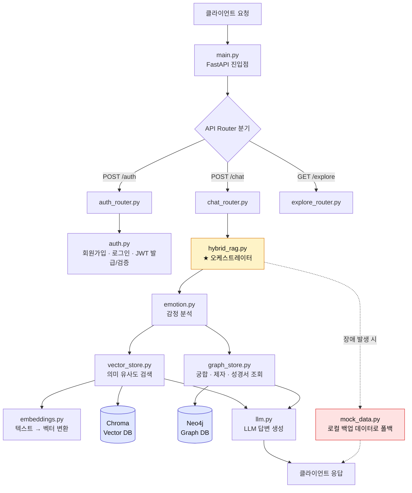
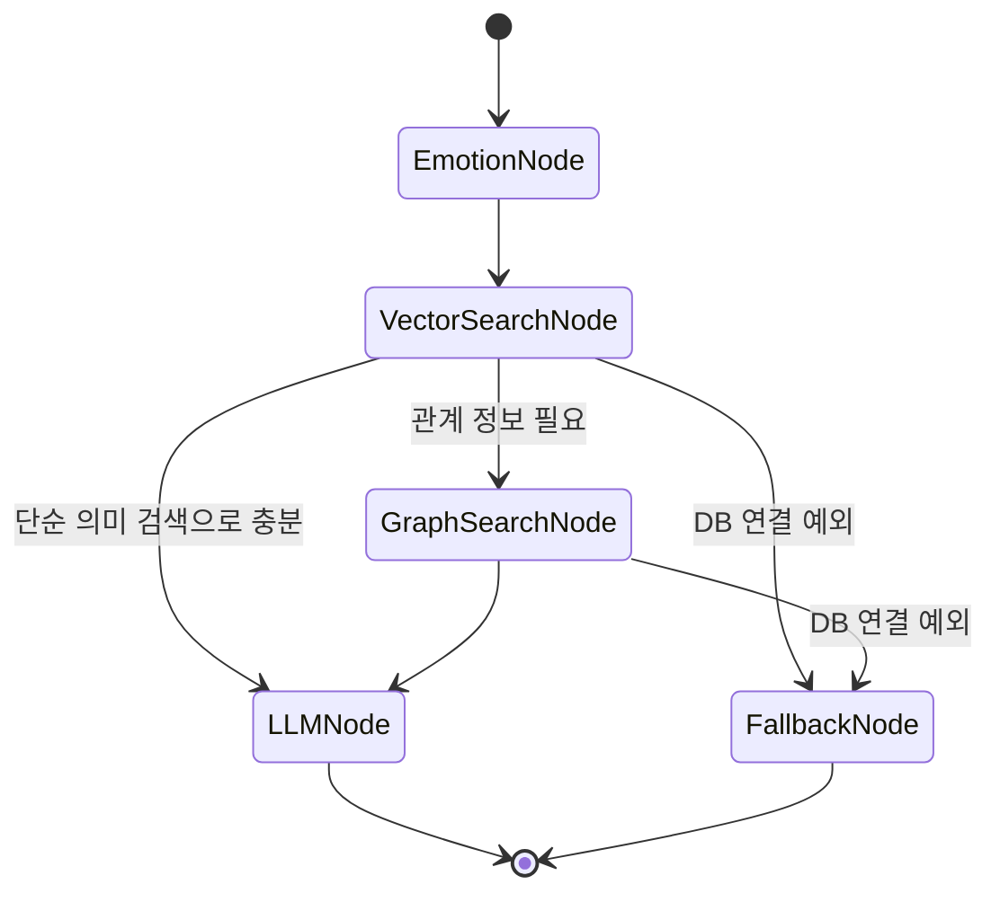
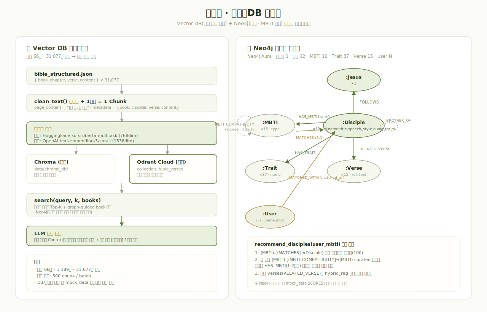

# 📖 Eden — 성경 인물 MBTI 궁합 기반 RAG 상담 챗봇

**Eden**은 사용자의 MBTI와 그날의 고민을 바탕으로 예수님·12제자 중 가장 잘 맞는 인물을 Neo4j 그래프로 찾아 매칭하고, 그 인물의 페르소나로 성경 구절 기반 위로를 건네는 **하이브리드 RAG(Vector + Graph) 상담 챗봇**입니다. ChatOpenAI(LLM)와 임베딩 모델을 결합해 사용자의 자연어 고민에 의미론적으로 가장 가까운 성경 구절을 검색하고, Neo4j에 저장된 curated MBTI 궁합 매트릭스로 "누가 답할지"를 함께 결정합니다.

> Streamlit 단일 프로세스로 서비스 중이며(`streamlit_app.py`), 배포는 Streamlit Community Cloud + Neo4j Aura + Qdrant Cloud 조합을 씁니다. 배포 상세는 [README_STREAMLIT.md](README_STREAMLIT.md) 참고.

## 1. 팀원 및 역할
<div align="center">
<table align="center">
  <tr>
    <td align="center" width="190px"></td>
    <td align="center" width="190px"></td>
    <td align="center" width="190px"></td>
    <td align="center" width="190px"></td>
  </tr>
  <tr>
    <td align="center"><b>안혁진(PM)</b></td>
    <td align="center"><b>김가율</b></td>
    <td align="center"><b>정형섭</b></td>
    <td align="center"><b>김재원</b></td>
  </tr>
    <tr>
    <td align="center">프론트엔드<br>설계, 기획</td>
    <td align="center">데이터 전처리, 정제<br>문서작성</td>
    <td align="center">Database 설계</td>
    <td align="center">RAG 시스템 구성</td>
  </tr>

  <tr>
    <td align="center"><a href="https://github.com/Jinxxxok"></a></td>
    <td align="center"><a href="https://github.com/Kim-gayul"></a></td>
    <td align="center"><a href="https://github.com/jhs7067"></a></td>
    <td align="center"><a href="https://github.com/kimjae9360"></a></td>
  </tr>
  
</table>

</div>

---
## 2. 주요 특징

유지보수의 효율성과 역할 분담을 극대화하기 위해 코드베이스를 **UI(Streamlit), 데이터 레이어(Vector DB + Graph DB), AI 레이어(services/hybrid_rag.py 오케스트레이터)** 로 분리하여 모듈화했습니다. HTTP 계층 없이 Streamlit이 백엔드 서비스 함수를 직접 호출하는 단일 프로세스 구조입니다.

- **의미론적 유사도 검색(Dense Retrieval)**: 단순한 키워드 매칭을 넘어, "마음이 슬플 때"와 같은 추상적인 유의어 및 문맥을 파악하여 관련 구절을 추출합니다.
- **Graph-guided 하이브리드 검색**: Neo4j가 먼저 "누가 답할지"(제자 궁합)와 "어떤 성경서 범위에서 찾을지"를 정하고, Vector DB가 그 범위 안에서 "무슨 말씀으로" 답할지 찾습니다.
- **실제 curated MBTI 궁합 매트릭스**: 16×16 MBTI 조합 전체에 대한 궁합 점수가 `(MBTI)-[:MBTI_COMPATIBILITY]->(MBTI)` 관계로 Neo4j에 저장되어 있어, 근사치가 아닌 실제 팀 curated 데이터로 추천 순위를 매깁니다.
- **대화 맥락 유지**: 예수님과 자유롭게 몇 턴 대화한 뒤 LLM이 스스로 "제자를 추천할 만큼 깊어졌는지" 판단해 전환하며, 예수님/각 제자와의 대화 이력을 완전히 분리해 서로 섞이지 않게 관리합니다.
- **핵심 구절 1개만 표기**: 검색된 여러 구절 중 LLM이 "이번 답변에서 실제로 근거로 삼은" 구절 하나만 답변 끝에 표기해, 관련 없는 구절이 나열되지 않습니다.
- **자원 최적화**: 무거운 생성형 모델은 ChatOpenAI로 구동하고, 임베딩은 로컬(HuggingFace) 또는 배포용(OpenAI text-embedding-3-small)으로 환경에 따라 전환합니다.
- **폴백 설계**: Neo4j/Vector DB/OpenAI 중 무엇이 끊겨도 `mock_data.py` 로컬 데이터로 즉시 대체되어 서비스가 멈추지 않습니다.
- **할루시네이션(환각) 방지**: 프롬프트 엔지니어링을 통해 제공된 성경 문맥 안에서만 답변하도록 페르소나를 제한했습니다.

## 3. 주요 기능
웹 시연
---

## 4. 프로젝트 구조 (Directory Structure)

```text
SKN31-3rd-3Team/
├── streamlit_app.py             # ★ 진입점. UI 전체 + backend/services 직접 import (HTTP 없음)
├── requirements.txt              # 루트 실행용 (streamlit + langchain + qdrant/chroma + auth)
├── assets/                       # 인물 아바타(webp), 배경 이미지
├── docs/                         # 아키텍처 다이어그램
├── data/                         # bible_structured.json(커밋됨), chroma_db/·users.json(gitignore)
├── backend/
│   ├── .env                      # OPENAI_API_KEY, NEO4J_*, QDRANT_* (커밋 안 됨)
│   ├── app/
│   │   ├── core/config.py         # ★ 모델·DB·경로 설정은 전부 여기
│   │   ├── services/
│   │   │   ├── embeddings.py       # 임베딩 프로바이더 팩토리 (hf/openai/ollama)
│   │   │   ├── llm.py              # LLM 프로바이더 팩토리 (openai/ollama/anthropic)
│   │   │   ├── vector_store.py     # Vector DB (Chroma 로컬 / Qdrant Cloud 배포, graph-guided 필터)
│   │   │   ├── graph_store.py      # Neo4j 궁합·제자·MBTI 매트릭스 조회
│   │   │   ├── bible_books.py      # 성경 66권 전체명 ↔ 약어 매핑 (필터 안전망)
│   │   │   ├── emotion.py          # 감정 추론 (키워드 + LLM 폴백)
│   │   │   ├── hybrid_rag.py       # ★ 오케스트레이터 (recommend/answer/should_recommend)
│   │   │   ├── prompts.py          # 예수님/제자 페르소나 시스템 프롬프트
│   │   │   ├── auth.py             # 회원가입·로그인 (bcrypt + data/users.json 영속화)
│   │   │   └── mock_data.py        # DB/API 미연결 시 폴백 데이터
│   │   ├── api/                    # FastAPI 라우터 (레거시, Streamlit 경로에서는 미사용)
│   │   └── main.py                 # FastAPI 진입점 (레거시)
│   └── scripts/
│       ├── build_vector_db.py       # 로컬 Chroma 재생성 CLI
│       └── migrate_neo4j_to_aura.py # 로컬 Neo4j → Aura 마이그레이션
├── README.md                     # 이 문서
└── README_STREAMLIT.md           # 실행/배포 가이드 (Streamlit Cloud + Neo4j Aura + Qdrant Cloud)
```

> `backend/app/api/`, `models/schemas.py`는 초기 FastAPI+React 설계의 흔적으로, 현재 서비스 중인 Streamlit 경로에서는 쓰이지 않습니다(`backend/app/services/*`를 직접 import). 남겨둬도 무방하나 신규 기능은 services/에만 추가하면 됩니다.


## 5. 수집한 데이터와 프로젝트의 관련성
* **도메인 특화 지식 구축**: 본 프로젝트는 사용자의 자연어 질문이나 키워드에 맞춰 정확한 성경 구절을 매칭하고, 이를 기반으로 답변을 생성하는 RAG(Retrieval-Augmented Generation) 시스템입니다.
* **의미론적 검색의 기반**: 성경은 비유적 표현, 고어(古語), 추상적인 개념이 많아 단순 키워드 매칭으로는 사용자의 의도(예: '마음이 슬플 때', '평안을 얻고 싶을 때')를 파악하기 어렵습니다. 따라서 전체 성경 데이터를 수집하고 벡터화하여 의미론적 유사도 검색(Dense Retrieval)이 가능하도록 기본 컨텍스트를 제공하는 핵심 역할을 합니다.

## 6. 데이터 수집
* **데이터명**: 성경 전서 (구약 성경 39권 및 신약 성경 27권, 총 66권)
* **데이터 규모**: 총 1,189장, 약 31,000개 이상의 구절(Verse) 데이터
* **데이터 구조**: 각 구절별로 서지 정보(책 이름, 장, 절)와 본문 내용이 매핑된 구조화된 형태의 텍스트 데이터(JSON형식 )
* **데이터 출처**: https://raw.githubusercontent.com/stranger828/bibleAPI/refs/heads/main/bible_structured.json


## 7. 수집한 데이터 전처리
본 프로젝트에서 사용한 데이터는 책 이름, 장, 절과 본문 내용이 명확히 구분되어 있습니다.  
LLM 및 Embedding 모델이 오차 없이 인식할 수 있도록 다음과 같은 전처리 단계 시도하였습니다.

### 7.1 문서 정제 방법 (Data Cleaning)
* **구조적 정제**: 불필요한 공백, 특수문자, 장/절의 식별을 방해하는 기호 등을 정규표현식(`re` 모듈)을 이용해 제거 및 통일
 -> 전처리 적용 결과 원본 데이터에서 변경된 사항이 없습니다.

* **예외 방어 처리**: 데이터 파일이 없을 경우 디폴트 문구로 처리함으로써, 추후 Vector DB 인덱싱 단계에서 `KeyError` 또는 `NullPointerException`이 발생하는 것을 원천 차단했습니다.

* **텍스트 표준화**: 파이썬의 `json` 모듈을 이용해 `UTF-8` 인코딩 형식을 강제 지정함으로써, 로컬 Windows 환경 및 Mac 환경 간의 한글 깨짐 현상을 방지했습니다.

### 7.2 Chunking 방법 및 기준
일반적인 RAG 시스템에서는 긴 문서를 임의의 글자 수(예: 500자, 1000자)로 쪼개는 Character/Token 기반 Chunking을 사용하지만, 성경 데이터의 특성을 고려하여 다음과 같은 **의미론적 최소 단위 기준(Semantic/Granular Chunking)** 을 적용했습니다.

* **Chunking 기준**: **'1구절(Verse)' 단위를 하나의 독립적인 Chunk(Document)로 간주**
  * *이유*: 성경은 하나의 절(Verse) 자체가 완전한 하나의 의미나 메시지를 담고 있는 경우가 많습니다. 임의의 글자 수로 자를 경우 장/절의 경계가 무너져 "어떤 책 몇 장 몇 절"인지 출처를 명확히 밝혀야 하는 성경 챗봇의 비기능적 요구사항을 충족할 수 없기 때문입니다.
* **데이터 결합 및 형태**: 검색 성능을 극대화하기 위해 page_content(인덱싱 대상)와 metadata(출처 정보)를 다음과 같이 분리 및 가공하여 LangChain의 `Document` 객체로 생성했습니다.
  * **page_content**: `"[책이름 장:절] 본문내용"` 형태로 조합하여, 검색 시 출처 정보와 본문이 함께 임베딩 벡터에 반영되도록 처리.
  * **metadata**: `{"book": "책이름", "chapter": 장(int), "verse": 절(int), "content": "본문내용"}` 객체를 결합하여, 향후 UI상에서 유저에게 깔끔하게 서지 정보를 분리 서빙할 수 있도록 구조화.
* **Vector DB 배치 저장**: 수집된 약 31,000개의 Chunk를 한 번에 DB에 주입하면 메모리 과부하(OOM)가 발생하므로, **500개 단위의 배치(Batch Size = 500)** 로 나누어 로컬 DB(`Chroma`)에 순차적으로 임베딩 및 저장하도록 전처리 파이프라인을 최적화했습니다.
---
## 8. 시스템 아키텍처 구성도



**흐름 설명**
1. 클라이언트 요청이 `main.py`(FastAPI 진입점)로 들어오면 목적에 따라 `auth` / `chat` / `explore` 라우터로 분기됩니다.
2. 챗봇 질의는 `hybrid_rag.py` 오케스트레이터가 받아 `emotion.py`로 사용자 발화의 감정을 먼저 파악합니다.
3. 감정·질의 내용을 바탕으로 `vector_store.py`(Chroma, 의미론적 유사도 검색)와 `graph_store.py`(Neo4j, 관계 기반 검색)를 함께 조회하는 하이브리드 검색을 수행합니다.
4. 검색된 컨텍스트를 `llm.py`가 받아 최종 답변을 생성하고, 응답이 클라이언트로 반환됩니다.
5. DB 연결 장애 등 예외 상황에서는 `mock_data.py`의 로컬 백업 데이터로 자동 폴백하여 서비스 중단 없이 응답을 유지합니다.

### Database 설계

**Vector DB — metadata 설계**

로컬 개발은 Chroma(`data/chroma_db/`, 자동 재생성), 배포판은 Qdrant Cloud(`bible_verses` 컬렉션, 사전 임베딩 스냅샷 복원)를 씁니다. 둘 다 아래와 동일한 metadata 스키마를 씁니다.

| 필드 | 타입 | 설명 |
|---|---|---|
| `page_content` | string | `"[책이름 장:절] 본문내용"` 형태로 조합된 임베딩 대상 텍스트 |
| `book` | string | 성경 책 **약어** (예: 창, 마, 벧전) — Qdrant 스냅샷 표기 기준 |
| `chapter` | int | 장 번호 |
| `verse` | int | 절 번호 |
| `content` | string | 구절 원문 (출처 정보와 분리해 UI 서빙용으로 별도 보관) |

질의 임베딩과의 코사인 유사도 기반 Top-K 검색을 기본으로 하며, Neo4j가 고른 제자의 연관 성경서로 `book` 메타데이터 필터를 적용해 범위를 좁힙니다(graph-guided filter). 필터에 넘기는 책 이름이 전체명/약어 어느 쪽이어도 `bible_books.normalize_books()`가 실제 인덱스 표기(약어)로 맞춰 줍니다.

**GraphDB (Neo4j) — 실제 Node / Relationship 설계**

Neo4j Aura에 직접 접속해 확인한 라이브 스키마입니다(예수 1 · 제자 12 · MBTI 16 · Trait 37 · Verse 15 · User N).

| 구분 | 종류 | 설명 |
|---|---|---|
| Node | `Jesus`, `Disciple`, `MBTI`, `Trait`, `Verse`, `User` | 예수님, 12제자, MBTI 16유형, 성향, 연관 성경 구절, 회원 |
| Relationship | `FOLLOWS`, `HAS_MBTI{rank}`, `MATCHES`, `MBTI_COMPATIBILITY{score}`, `HAS_TRAIT`, `RELATED_VERSE`, `BROTHER_OF`, `MATCHED_WITH{matched_at}` | 아래 상세 |
| Disciple Property | `id, name, title, speech_style, quote, quote_ref, traits, role, epithet, person_order` | 카드/프롬프트에 쓰는 인물 정보 (그래프 자체에 저장, mock_data는 보조 폴백) |

| 관계 | 방향 | 의미 |
|---|---|---|
| `FOLLOWS` | Disciple → Jesus | 제자가 예수님을 따름 |
| `HAS_MBTI {rank}` | Disciple → MBTI | 제자 자신과 어울리는 MBTI 1·2순위 |
| `MATCHES` | MBTI → Disciple | 사용자 MBTI → 직접 매칭되는 제자 (16종 1:1) |
| `MBTI_COMPATIBILITY {score}` | MBTI → MBTI | 16×16 전체 궁합 curated 매트릭스 (256쌍) |
| `HAS_TRAIT` | Disciple → Trait | 제자의 성향 키워드 |
| `RELATED_VERSE` | Disciple → Verse | 제자와 연관된 성경 구절 (실제 본문 포함) |
| `BROTHER_OF` | Disciple → Disciple | 형제 관계 (베드로-안드레, 야고보-요한) |
| `MATCHED_WITH {matched_at}` | User → Disciple | 회원이 실제로 매칭된 이력 |

`graph_store.py`는 이 그래프를 조회해 (1) `MATCHES` 직접 매칭이면 최고점, (2) 아니면 `MBTI_COMPATIBILITY` curated 점수로 순위를 매겨 벡터 검색만으로는 파악하기 어려운 **인물 간 궁합 · 관계 정보**를 보강합니다. Neo4j 연결 실패 시 `mock_data.SCORES`(동일 curated 매트릭스의 로컬 사본)로 자동 폴백합니다.

> 아래 [Neo4j · VectorDB 구성도](#10-neo4j--vectordb-구성도)에서 전체 파이프라인을 다이어그램으로 볼 수 있습니다.

### RAG 시스템 구성

`hybrid_rag.py`는 LangGraph 기반의 **StateGraph**로 구성되어, 감정 분석 → 벡터 검색 → 그래프 검색 → 답변 생성의 각 처리 단계를 독립된 노드로 분리하고, 예외 발생 시 폴백 노드로 조건부 라우팅합니다.



| 구성요소 | 담당 파일 | 역할 / 기능 |
|---|---|---|
| `EmotionNode` | emotion.py | 사용자 발화의 감정을 키워드 매칭으로 1차 분류, 애매한 경우 LLM으로 재분류하는 2단계 감정 추론 |
| `VectorSearchNode` | vector_store.py, embeddings.py | 질의를 벡터로 변환해 Chroma에서 의미론적으로 가장 유사한 성경 구절 Top-K를 검색 |
| `GraphSearchNode` | graph_store.py | Neo4j에서 인물 관계·궁합 등 벡터 검색만으로는 얻기 어려운 구조적 정보를 보강 조회 |
| `LLMNode` | llm.py | 검색된 구절과 그래프 컨텍스트를 프롬프트로 결합해 ChatOpenAI 기반 최종 답변 생성 |
| `FallbackNode` | mock_data.py | Vector/Graph DB 연결 실패 시 로컬 목업 데이터로 즉시 대체 응답, 서비스 중단 방지 |

> ⚠️ 위 그래프 구조는 `hybrid_rag.py`의 모듈 구성을 기준으로 정리했어. 실제 노드 분기 조건이 다르면 알려주면 바로 맞춰서 수정할게.

## 9. Application의 주요 기능

Eden은 크게 다섯 가지 핵심 기능으로 구성되어 있습니다.

첫째, **예수님과의 자유 대화 → 제자 추천**입니다. 사용자가 고민을 적으면 곧바로 제자를 추천하지 않고, 예수님과 몇 턴 자유롭게 대화합니다. LLM이 대화가 충분히 깊어졌다고 판단하면 그때 MBTI 궁합이 가장 잘 맞는 제자를 추천 카드로 보여주고, 수락 시 예수님과 나눈 대화 요약(`shared_memory`)을 그대로 들고 넘어가 맥락이 끊기지 않습니다.

둘째, **Neo4j curated MBTI 궁합 기반 추천**입니다. "누가 답할지"는 16×16 전체 조합의 실제 curated 궁합 점수(`MBTI_COMPATIBILITY`)와 사용자 MBTI-제자 직접 매칭(`MATCHES`)을 함께 반영해 결정하며, 단순 글자 유사도 근사가 아닙니다.

셋째, **자연어 기반 성경 구절 검색 및 상담**입니다. 사용자가 "마음이 슬플 때", "위로가 필요할 때"와 같이 일상어로 질문을 입력하면, 하이브리드 RAG 파이프라인(그래프가 고른 성경서 범위 + 벡터 유사도 검색)이 가장 관련성 높은 구절을 찾고, LLM이 답변에서 실제로 근거로 삼은 구절 1개만 표시합니다.

넷째, **대화 상대별 맥락 완전 분리**입니다. 예수님과의 대화, 그리고 이후 이어지는 제자와의 대화는 서로 다른 스레드로 완전히 분리되어 기록됩니다 — 다른 상대에게 한 말이 섞여 들어가 엉뚱한 답변으로 이어지는 문제를 원천 차단합니다.

다섯째, **회원 인증 및 개인화**입니다. bcrypt 해시 + 원자적 파일 쓰기로 실제 영속화되는 회원가입/로그인을 지원하며, 성별에 따라 예수님/제자가 "형제님"/"자매님" 호칭을 자동으로 맞추고 이름은 성을 뗀 형태로 자연스럽게 부릅니다.

(※ 실제 시연 화면 캡처는 추후 추가 예정)


## 🛠️ 설치 및 사전 준비

현재 Eden은 **Streamlit 단일 프로세스 앱**으로 동작합니다. 별도의 FastAPI 서버를 띄울 필요 없이, 루트에서 `streamlit run streamlit_app.py` 한 줄로 실행됩니다.

1. 가상환경 설치
```code
uv  venv  .venv  --python=3.13
```
2. 가상환경 실행
```code
.venv\Scripts\activate
```

3. 필수 라이브러리 설치  
루트 디렉토리의 `requirements.txt`를 그대로 설치합니다 (backend 폴더로 이동할 필요 없음).
```code
uv pip install -r requirements.txt
```

4. 환경 변수(.env) 설정  
루트에 `.env` 파일을 만들고 아래 값을 채웁니다. (`README_STREAMLIT.md`에 배포용 secrets 전체 예시가 있습니다.)
```code
OPENAI_API_KEY=sk-...
LLM_MODEL=gpt-4o-mini

NEO4J_URI=neo4j+s://<your-instance>.databases.neo4j.io
NEO4J_USER=neo4j
NEO4J_PASSWORD=...
NEO4J_DATABASE=neo4j

# 로컬 개발은 Chroma(자동 생성)로 충분하며, QDRANT_URL을 비워두면 자동으로 Chroma를 사용합니다.
QDRANT_URL=
QDRANT_API_KEY=
QDRANT_COLLECTION=bible_verses
```

5. 데이터 파일 배치  
`data/bible_structured.json` 파일이 존재하는지 확인합니다. 데이터 구조는 아래 형식을 따릅니다.
```code
[
  {
    "book": "창세기",
    "chapter": 1,
    "verse": 1,
    "content": "태초에 하나님이 천지를 창조하시니라"
  }
]
```

6. 앱 실행
```code
streamlit run streamlit_app.py
```
---
### 💡최초 실행 시 주의사항  
- Qdrant Cloud(`QDRANT_URL`)를 설정하지 않은 로컬 개발 환경에서는 최초 실행 시 성경 전체 데이터를 벡터화하는 Chroma 임베딩 작업이 자동 진행됩니다. 로컬 자원(CPU)에 따라 최초 1회에 한해 수 분(약 20분)의 시간이 소요될 수 있습니다.
- 임베딩이 완료되면 `data/chroma_db` 폴더가 자동 생성되며, 이후 실행 시에는 대기 시간 없이 즉시 실행됩니다.
- 배포 환경(Streamlit Community Cloud)에서는 Qdrant Cloud에 미리 임베딩해둔 컬렉션을 그대로 사용하므로 재임베딩 과정이 없습니다.

### ⚙️Backend 주요 모듈별 역할 정의(상세 설명은 각 파일 참고)

`streamlit_app.py`가 아래 서비스 함수들을 직접 import해서 사용하는 구조이며(HTTP 계층 없음), 실제로 동작하는 모듈은 다음과 같습니다.

1. auth.py : bcrypt 해시 기반 회원가입/로그인 및 프로필 관리 (JSON 파일 영속화)
2. bible_books.py : 성경서 전체 이름 ↔ 축약형(Qdrant 저장 포맷) 매핑/정규화
3. config.py : Eden 전역 설정 (Neo4j / Qdrant·Chroma / OpenAI 등 환경 변수 로드)
4. embeddings.py : 임베딩 모델 인스턴스 생성 및 추상화 레이어
5. emotion.py : 사용자 발화(질문)의 감정 분석 및 분류 서비스
6. graph_store.py : Neo4j Graph DB 조회 및 연동 서비스 (MBTI 궁합, 제자 추천)
7. hybrid_rag.py : 하이브리드 RAG (Graph DB + Vector DB + LLM) 파이프라인 제어 오케스트레이터
8. llm.py : 대형 언어 모델(LLM) 인스턴스 생성 및 추상화 레이어
9. mock_data.py : 외부 인프라 미연결/장애 대비 로컬 폴백 데이터 및 서비스 목업
10. prompts.py : 예수님/제자 페르소나 시스템 프롬프트 및 턴별(첫 턴/이어지는 턴) 분기 로직
11. vector_store.py : 성경 구절 벡터 저장소(Chroma/Qdrant 겸용) 및 유사도 검색 서비스

> ⚠️ `backend/app/api/`, `backend/app/models/schemas.py`, `main.py` 등 FastAPI 라우터/엔트리포인트는 초기 설계 당시의 잔재로 저장소에 남아있지만, 현재 Streamlit 실행 경로에서는 사용되지 않습니다.
---

## 10. Neo4j · VectorDB 구성도

Neo4j 그래프 스키마와 Vector DB(Chroma/Qdrant) 임베딩 파이프라인을 와이어프레임 형태로 정리한 구성도입니다.



- **왼쪽 (Vector DB 파이프라인)**: `bible_structured.json` → OpenAI `text-embedding-3-small` 임베딩 → Chroma(로컬 개발) / Qdrant Cloud(운영, 31,077 포인트) 저장 → 그래프가 좁힌 성경서 범위로 필터링된 유사도 검색.
- **오른쪽 (Neo4j 그래프 스키마)**: `User` — `MBTI` — `Disciple` — `Jesus` 노드와 `MATCHES`, `MBTI_COMPATIBILITY{score}`, `HAS_MBTI{rank}`, `HAS_TRAIT`, `RELATED_VERSE`, `FOLLOWS` 관계로 "누가 답할지"를 결정하는 구조.

두 파이프라인은 `hybrid_rag.py`에서 결합됩니다 — Neo4j가 먼저 답변자(제자/예수님)와 관련 성경서 범위를 정하면, 그 범위 안에서 Vector DB가 의미상 가장 관련 있는 구절을 찾습니다.
---
